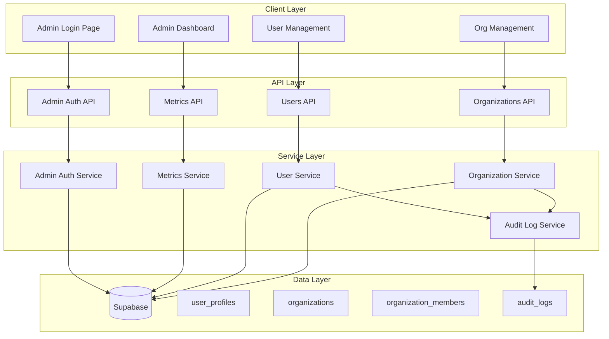

# Admin Dashboard Design Document

## Overview

The Admin Dashboard is a secure administrative interface that enables super admins and organization admins to manage users, organizations, and monitor system-wide metrics. The feature introduces a dedicated admin login flow, protected admin routes, and a clean dashboard interface for administrative operations.

The implementation leverages the existing multi-tenant schema with `organizations`, `organization_members`, and the `is_super_admin` flag on `user_profiles`. The admin dashboard will be built as a separate route group (`/admin/*`) with its own layout and authentication middleware.

## Architecture



## Components and Interfaces

### 1. Admin Authentication

```typescript
// lib/admin-auth.ts
interface AdminAuthResult {
  success: boolean;
  user: UserProfile | null;
  error?: string;
}

interface AdminSession {
  userId: string;
  email: string;
  isSuper: boolean;
  organizationId: string | null;
  role: OrgRole;
}

// Validates user has admin privileges
async function validateAdminAccess(userId: string): Promise<boolean>;

// Gets admin session from request
async function getAdminSession(): Promise<AdminSession | null>;

// Checks if user can perform action on target
async function canPerformAdminAction(
  adminId: string,
  action: AdminAction,
  targetId: string
): Promise<boolean>;
```

### 2. Admin Dashboard Components

```typescript
// components/admin/admin-layout.tsx
interface AdminLayoutProps {
  children: React.ReactNode;
}

// components/admin/admin-sidebar.tsx
interface AdminSidebarProps {
  currentPath: string;
}

// components/admin/metric-card.tsx
interface AdminMetricCardProps {
  title: string;
  value: number;
  description: string;
  icon: LucideIcon;
  trend?: { value: number; isPositive: boolean };
}

// components/admin/user-table.tsx
interface UserTableProps {
  users: AdminUserView[];
  onRoleChange: (userId: string, role: OrgRole) => void;
  onDeactivate: (userId: string) => void;
}

// components/admin/org-table.tsx
interface OrgTableProps {
  organizations: AdminOrgView[];
  onEdit: (orgId: string) => void;
  onDeactivate: (orgId: string) => void;
}
```

### 3. API Routes

```typescript
// Admin Auth
POST / api / admin / auth / login;
GET / api / admin / auth / session;
POST / api / admin / auth / logout;

// Dashboard Metrics
GET / api / admin / metrics;

// User Management
GET / api / admin / users;
GET / api / admin / users / [userId];
POST / api / admin / users;
PATCH / api / admin / users / [userId];
DELETE / api / admin / users / [userId];

// Organization Management
GET / api / admin / organizations;
GET / api / admin / organizations / [orgId];
POST / api / admin / organizations;
PATCH / api / admin / organizations / [orgId];
DELETE / api / admin / organizations / [orgId];
```

### 4. Admin Services

```typescript
// lib/services/admin-metrics.ts
interface DashboardMetrics {
  totalUsers: number;
  totalOrganizations: number;
  subscriptionsByPlan: Record<string, number>;
  recentRegistrations: UserProfile[];
  activeUsers: number;
}

async function getDashboardMetrics(): Promise<DashboardMetrics>;

// lib/services/admin-users.ts
interface AdminUserView {
  id: string;
  email: string;
  displayName: string | null;
  role: OrgRole | null;
  organizationName: string | null;
  subscriptionStatus: string;
  subscriptionPlan: string;
  isActive: boolean;
  createdAt: string;
}

interface CreateUserInput {
  email: string;
  displayName: string;
  role: OrgRole;
  organizationId: string;
}

async function listUsers(params: ListParams): Promise<PaginatedResult<AdminUserView>>;
async function getUserById(userId: string): Promise<AdminUserView | null>;
async function createUser(input: CreateUserInput): Promise<AdminUserView>;
async function updateUserRole(userId: string, role: OrgRole): Promise<void>;
async function deactivateUser(userId: string): Promise<void>;

// lib/services/admin-organizations.ts
interface AdminOrgView {
  id: string;
  name: string;
  slug: string;
  memberCount: number;
  isActive: boolean;
  createdAt: string;
}

async function listOrganizations(): Promise<AdminOrgView[]>;
async function getOrganizationById(orgId: string): Promise<AdminOrgView | null>;
async function createOrganization(input: CreateOrgInput): Promise<AdminOrgView>;
async function updateOrganization(orgId: string, input: UpdateOrgInput): Promise<void>;
async function deactivateOrganization(orgId: string): Promise<void>;
```

## Data Models

### Audit Log Table (New)

```sql
CREATE TABLE IF NOT EXISTS audit_logs (
  id UUID PRIMARY KEY DEFAULT uuid_generate_v4(),
  admin_id UUID NOT NULL REFERENCES user_profiles(id),
  action TEXT NOT NULL,
  target_type TEXT NOT NULL,
  target_id UUID,
  details JSONB DEFAULT '{}',
  ip_address TEXT,
  created_at TIMESTAMP DEFAULT NOW()
);

CREATE INDEX idx_audit_logs_admin_id ON audit_logs(admin_id);
CREATE INDEX idx_audit_logs_action ON audit_logs(action);
CREATE INDEX idx_audit_logs_created_at ON audit_logs(created_at DESC);
```

### Admin Action Types

```typescript
type AdminAction =
  | 'user.create'
  | 'user.update_role'
  | 'user.deactivate'
  | 'user.reactivate'
  | 'org.create'
  | 'org.update'
  | 'org.deactivate'
  | 'org.reactivate';

interface AuditLogEntry {
  id: string;
  adminId: string;
  action: AdminAction;
  targetType: 'user' | 'organization';
  targetId: string;
  details: Record<string, unknown>;
  ipAddress: string | null;
  createdAt: string;
}
```

### View Types for Admin Dashboard

```typescript
interface AdminUserView {
  id: string;
  email: string;
  displayName: string | null;
  role: OrgRole | null;
  organizationId: string | null;
  organizationName: string | null;
  subscriptionStatus: string;
  subscriptionPlan: string;
  isActive: boolean;
  isSuperAdmin: boolean;
  createdAt: string;
  updatedAt: string;
}

interface AdminOrgView {
  id: string;
  name: string;
  slug: string;
  logoUrl: string | null;
  memberCount: number;
  adminCount: number;
  isActive: boolean;
  createdAt: string;
  updatedAt: string;
}

interface PaginatedResult<T> {
  data: T[];
  total: number;
  page: number;
  pageSize: number;
  totalPages: number;
}

interface ListParams {
  page?: number;
  pageSize?: number;
  search?: string;
  sortBy?: string;
  sortOrder?: 'asc' | 'desc';
}
```

## Correctness Properties

_A property is a characteristic or behavior that should hold true across all valid executions of a system-essentially, a formal statement about what the system should do. Properties serve as the bridge between human-readable specifications and machine-verifiable correctness guarantees._

Based on the prework analysis, the following correctness properties have been identified:

### Property 1: Admin authentication grants access

_For any_ user with `is_super_admin = true` or with `role IN ('super_admin', 'admin')` in organization_members, when they authenticate through the admin login, the system should grant access to admin routes.
**Validates: Requirements 1.2**

### Property 2: Non-admin authentication is rejected

_For any_ user without admin privileges (not super_admin and no admin role in any organization), when they attempt to authenticate through admin login, the system should reject the attempt and return an error.
**Validates: Requirements 1.3**

### Property 3: Dashboard metrics match database counts

_For any_ database state, the dashboard metrics (total users, total organizations, subscriptions by plan, recent registrations) should exactly match the actual counts from the respective database tables.
**Validates: Requirements 2.1, 2.2, 2.3, 2.4**

### Property 4: User search filters correctly

_For any_ search query string, the filtered user list should only contain users whose email OR display_name contains the search string (case-insensitive).
**Validates: Requirements 3.2**

### Property 5: User role update round-trip

_For any_ valid role update operation, reading the user's role immediately after the update should return the newly assigned role.
**Validates: Requirements 3.4**

### Property 6: User deactivation prevents login

_For any_ deactivated user, subsequent authentication attempts should fail regardless of correct credentials.
**Validates: Requirements 3.5**

### Property 7: User creation persists correctly

_For any_ valid user creation input, the created user should exist in both Supabase auth and user_profiles table with matching email and display_name.
**Validates: Requirements 4.2**

### Property 8: Duplicate email creation fails

_For any_ email that already exists in the system, attempting to create a new user with that email should fail with an appropriate error.
**Validates: Requirements 4.4**

### Property 9: Organization creation with admin assignment

_For any_ valid organization creation with an initial admin, the organization should be created and the specified user should have admin role in organization_members.
**Validates: Requirements 5.3**

### Property 10: Organization settings update round-trip

_For any_ valid organization settings update, reading the organization immediately after should return the updated settings.
**Validates: Requirements 5.4**

### Property 11: Organization deactivation prevents member access

_For any_ deactivated organization, members should not be able to access organization resources or appear in active organization queries.
**Validates: Requirements 5.5**

### Property 12: Route protection validates auth and privileges

_For any_ admin route access, the system should verify: (1) user is authenticated, (2) user has admin privileges. Unauthenticated requests redirect to login; authenticated non-admins receive access denied.
**Validates: Requirements 6.1, 6.2, 6.3**

### Property 13: Admin actions create audit logs

_For any_ admin action (user create/update/deactivate, org create/update/deactivate), an audit log entry should be created with the admin's user ID, action type, target ID, and timestamp.
**Validates: Requirements 6.5**

## Error Handling

### Authentication Errors

- Invalid credentials: Return generic "Invalid email or password" message (no email existence leak)
- Non-admin access: Return "Access denied. Admin privileges required."
- Session expired: Redirect to login with "Session expired. Please log in again."

### API Errors

- 401 Unauthorized: User not authenticated
- 403 Forbidden: User authenticated but lacks admin privileges
- 404 Not Found: Requested resource doesn't exist
- 409 Conflict: Duplicate email on user creation
- 422 Unprocessable Entity: Invalid input data
- 500 Internal Server Error: Unexpected server error

### Client-Side Error Handling

- Display toast notifications for transient errors
- Show inline validation errors for form inputs
- Provide retry mechanisms for failed API calls
- Log errors to console in development mode

## Testing Strategy

### Unit Testing

Unit tests will verify specific examples and edge cases:

- Admin auth validation logic
- Metrics calculation functions
- Search filtering logic
- Role permission checks
- Input validation functions

### Property-Based Testing

Property-based tests will use **fast-check** library to verify universal properties across many inputs:

- Each property test will run a minimum of 100 iterations
- Tests will be tagged with format: `**Feature: admin-dashboard, Property {number}: {property_text}**`

Properties to test:

1. Admin authentication access control
2. Non-admin rejection
3. Metrics accuracy
4. Search filter correctness
5. Role update persistence
6. Deactivation login prevention
7. User creation persistence
8. Duplicate email rejection
9. Organization creation with admin
10. Settings update persistence
11. Organization deactivation access
12. Route protection
13. Audit log creation

### Integration Testing

- End-to-end admin login flow
- User CRUD operations
- Organization CRUD operations
- Metrics API accuracy against database state
