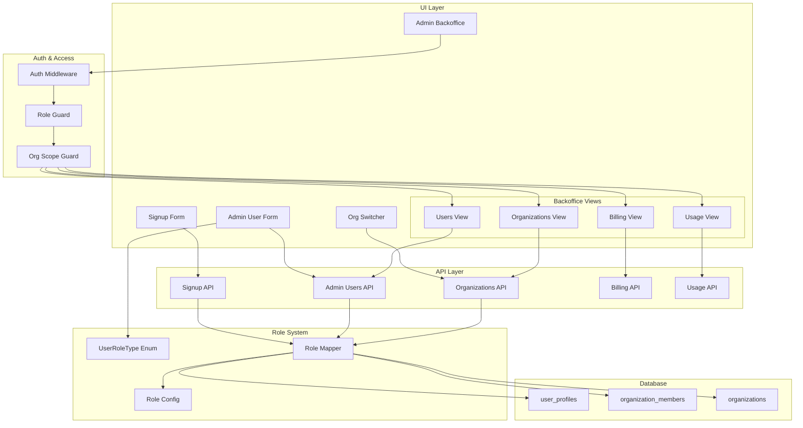

# Design Document: Customer Role Selection & Multi-Tenant Admin Backoffice

## Overview

This feature implements a three-role system (Customer, Customer Admin, Super Admin) with multi-tenant architecture and organization-scoped admin backoffice. The system provides:

1. **Role-based access control** - Three distinct roles with different permission levels
2. **Organization isolation** - Customer Admins see only their organization's data
3. **Organization switching** - Users can switch between organizations they belong to
4. **Admin backoffice** - Dashboard for viewing organizations, users, billing status, and usage metrics

## Architecture



## Components and Interfaces

### 1. UserRoleType Enum (`lib/types.ts`)

```typescript
// Three-role user type enum for UI
export enum UserRoleType {
  CUSTOMER = 'customer',
  CUSTOMER_ADMIN = 'customer_admin',
  SUPER_ADMIN = 'super_admin',
}

// Role configuration with display labels and database mappings
export interface RoleConfig {
  value: UserRoleType;
  label: string;
  description: string;
  dbOrgRole: OrgRole;
  isSuperAdmin: boolean;
  canAccessBackoffice: boolean;
  backofficeScope: 'none' | 'organization' | 'platform';
}
```

### 2. Role Configuration (`lib/role-config.ts`)

```typescript
export const ROLE_CONFIGS: Record<UserRoleType, RoleConfig> = {
  [UserRoleType.CUSTOMER]: {
    value: UserRoleType.CUSTOMER,
    label: 'Customer',
    description: 'End-user with access to their own data',
    dbOrgRole: 'member',
    isSuperAdmin: false,
    canAccessBackoffice: false,
    backofficeScope: 'none',
  },
  [UserRoleType.CUSTOMER_ADMIN]: {
    value: UserRoleType.CUSTOMER_ADMIN,
    label: 'Customer Admin',
    description: 'Organization administrator with access to org data',
    dbOrgRole: 'admin',
    isSuperAdmin: false,
    canAccessBackoffice: true,
    backofficeScope: 'organization',
  },
  [UserRoleType.SUPER_ADMIN]: {
    value: UserRoleType.SUPER_ADMIN,
    label: 'Super Admin',
    description: 'Platform administrator with full access',
    dbOrgRole: 'super_admin',
    isSuperAdmin: true,
    canAccessBackoffice: true,
    backofficeScope: 'platform',
  },
};

export function getRoleOptions(): RoleConfig[];
export function mapToUserRole(orgRole: OrgRole, isSuperAdmin: boolean): UserRoleType;
export function mapToDbFields(role: UserRoleType): { orgRole: OrgRole; isSuperAdmin: boolean };
export function getRoleLabel(role: UserRoleType): string;
export function canAccessBackoffice(role: UserRoleType): boolean;
export function getBackofficeScope(role: UserRoleType): 'none' | 'organization' | 'platform';
```

### 3. Organization Scope Service (`lib/services/org-scope.ts`)

```typescript
export interface OrgScopeContext {
  userId: string;
  currentOrgId: string;
  userRole: UserRoleType;
  isSuperAdmin: boolean;
}

export function createOrgScopeContext(session: AdminSession): Promise<OrgScopeContext>;
export function applyOrgScope<T>(
  query: SupabaseQuery<T>,
  context: OrgScopeContext
): SupabaseQuery<T>;
export function canAccessOrg(context: OrgScopeContext, targetOrgId: string): boolean;
export function getAccessibleOrgIds(context: OrgScopeContext): Promise<string[]>;
```

### 4. Organization Switcher Component (`components/org-switcher.tsx`)

```typescript
interface OrgSwitcherProps {
  currentOrgId: string;
  organizations: OrganizationWithRole[];
  onSwitch: (orgId: string) => void;
}
```

### 5. Admin Backoffice Layout (`app/admin/layout.tsx`)

Role-based navigation structure:

- **Customer Admin**: Users, Billing, Usage (org-scoped)
- **Super Admin**: Organizations, All Users, Platform Billing, Platform Usage

### 6. Backoffice API Endpoints

| Endpoint                     | Customer Admin Access | Super Admin Access       |
| ---------------------------- | --------------------- | ------------------------ |
| GET /api/admin/organizations | Own org only          | All orgs                 |
| GET /api/admin/users         | Org members only      | All users (filterable)   |
| GET /api/admin/billing       | Own org billing       | All/selected org billing |
| GET /api/admin/usage         | Own org usage         | Platform-wide metrics    |

## Data Models

### Role Mapping Table (Updated)

| UserRoleType   | org_role (DB) | is_super_admin (DB) | Display Label  | Backoffice Access |
| -------------- | ------------- | ------------------- | -------------- | ----------------- |
| CUSTOMER       | member        | false               | Customer       | None              |
| CUSTOMER_ADMIN | admin         | false               | Customer Admin | Organization      |
| SUPER_ADMIN    | super_admin   | true                | Super Admin    | Platform          |

### Backward Compatibility Mapping (Updated)

| Existing org_role | is_super_admin | Maps to UserRoleType |
| ----------------- | -------------- | -------------------- |
| super_admin       | true           | SUPER_ADMIN          |
| super_admin       | false          | SUPER_ADMIN          |
| admin             | true           | SUPER_ADMIN          |
| admin             | false          | CUSTOMER_ADMIN       |
| member            | true           | SUPER_ADMIN          |
| member            | false          | CUSTOMER             |
| viewer            | true           | SUPER_ADMIN          |
| viewer            | false          | CUSTOMER             |

### Usage Metrics Model

```typescript
export interface UsageMetrics {
  organization_id: string;
  article_count: number;
  storage_bytes: number;
  api_calls_month: number;
  last_updated: string;
}
```

### Billing Status Model

```typescript
export interface BillingStatus {
  organization_id: string;
  subscription_status: string;
  plan_name: string;
  billing_cycle: 'monthly' | 'yearly';
  next_billing_date: string | null;
  amount_cents: number;
  currency: string;
}
```

## Correctness Properties

_A property is a characteristic or behavior that should hold true across all valid executions of a system-essentially, a formal statement about what the system should do. Properties serve as the bridge between human-readable specifications and machine-verifiable correctness guarantees._

### Property 1: Signup creates customer with correct database state

_For any_ valid signup input (name, email, password), when the signup completes successfully, the created user SHALL have:

- `is_super_admin` set to `false` in user_profiles
- A record in organization_members with role `member`
- The mapped display role SHALL be `Customer`

**Validates: Requirements 1.1, 1.2, 1.3**

### Property 2: User creation role mapping consistency

_For any_ user creation through admin dashboard with a selected UserRoleType:

- When `CUSTOMER` is selected, the user SHALL have `org_role = 'member'` and `is_super_admin = false`
- When `CUSTOMER_ADMIN` is selected, the user SHALL have `org_role = 'admin'` and `is_super_admin = false`
- When `SUPER_ADMIN` is selected, the user SHALL have `org_role = 'super_admin'` and `is_super_admin = true`

**Validates: Requirements 2.2, 2.3, 2.4**

### Property 3: Display label mapping consistency

_For any_ UserRoleType enum value, the `getRoleLabel()` function SHALL return the corresponding display label:

- `CUSTOMER` → "Customer"
- `CUSTOMER_ADMIN` → "Customer Admin"
- `SUPER_ADMIN` → "Super Admin"

**Validates: Requirements 3.2**

### Property 4: Role mapping round-trip consistency

_For any_ UserRoleType value, mapping to database fields and back SHALL produce the original UserRoleType:

- `mapToUserRole(mapToDbFields(role).orgRole, mapToDbFields(role).isSuperAdmin) === role`

**Validates: Requirements 3.3**

### Property 5: Backward compatible role mapping

_For any_ combination of existing `org_role` and `is_super_admin` values:

- If `is_super_admin = true`, the mapped role SHALL be `SUPER_ADMIN`
- If `is_super_admin = false` AND `org_role = 'admin'`, the mapped role SHALL be `CUSTOMER_ADMIN`
- If `is_super_admin = false` AND `org_role IN ('member', 'viewer')`, the mapped role SHALL be `CUSTOMER`
- If `org_role = 'super_admin'`, the mapped role SHALL be `SUPER_ADMIN`

**Validates: Requirements 4.2, 4.3, 4.4, 5.1, 5.2, 5.3, 5.4**

### Property 6: Customer Admin organization scoping

_For any_ Customer Admin user and any data query:

- The query results SHALL contain only records where `organization_id` matches the user's `current_organization_id`
- Attempting to access data with a different `organization_id` SHALL return an authorization error
- The user list SHALL contain only users who are members of the same organization

**Validates: Requirements 6.2, 6.3, 6.4**

### Property 7: Super Admin cross-organization access

_For any_ Super Admin user:

- Organization list queries SHALL return all active organizations
- User list queries SHALL return users from all organizations
- The user SHALL be able to filter by any organization_id without authorization errors

**Validates: Requirements 7.1, 7.2, 7.3, 7.4**

### Property 8: Organization switching updates context

_For any_ user with multiple organization memberships, when switching organizations:

- The `current_organization_id` in user_profiles SHALL be updated to the selected organization
- Subsequent data queries SHALL be scoped to the newly selected organization
- The user's effective role SHALL be their role within the selected organization

**Validates: Requirements 8.2, 8.3**

### Property 9: Billing and usage data scoping

_For any_ billing or usage query:

- Customer Admin queries SHALL return data only for their current organization
- Super Admin queries SHALL return data for the specified organization or aggregated platform data
- The returned data SHALL match the organization scope of the requesting user

**Validates: Requirements 9.1, 9.2, 9.3, 9.4**

### Property 10: Role-based navigation visibility

_For any_ user accessing the admin backoffice:

- Customer role users SHALL be denied access (redirect to customer dashboard)
- Customer Admin users SHALL see only organization-scoped navigation items
- Super Admin users SHALL see all navigation items including platform-wide options

**Validates: Requirements 10.1, 10.2, 10.3**

## Error Handling

| Scenario                              | Error Response                           | Recovery                           |
| ------------------------------------- | ---------------------------------------- | ---------------------------------- |
| Invalid role value passed to mapper   | Throw TypeError with descriptive message | Validate input at API boundary     |
| Unknown org_role from database        | Default to CUSTOMER role                 | Log warning for investigation      |
| Customer Admin accessing other org    | 403 Forbidden with "Access denied"       | Redirect to own org dashboard      |
| Customer accessing backoffice         | 403 Forbidden                            | Redirect to customer dashboard     |
| Organization switch to non-member org | 403 Forbidden                            | Show error toast, keep current org |
| Role dropdown fails to load           | Show error message, disable form         | Retry button to reload options     |

## Testing Strategy

### Unit Testing

Unit tests will cover:

- Role configuration object structure validation
- Individual mapping function edge cases
- Organization scope filtering logic
- Navigation item visibility logic

### Property-Based Testing

Property-based tests will use `fast-check` library to verify:

- Role mapping functions maintain consistency across all inputs
- Round-trip property for role conversion
- Organization scoping correctly filters data
- Backward compatibility with all existing org_role values

Each property-based test will:

- Run a minimum of 100 iterations
- Be tagged with the corresponding correctness property reference
- Use format: `**Feature: customer-role-selection, Property {number}: {property_text}**`

### Test File Structure

```
lib/
  role-config.ts
  role-config.test.ts
  role-config.property.test.ts
  services/
    org-scope.ts
    org-scope.test.ts
    org-scope.property.test.ts
```
