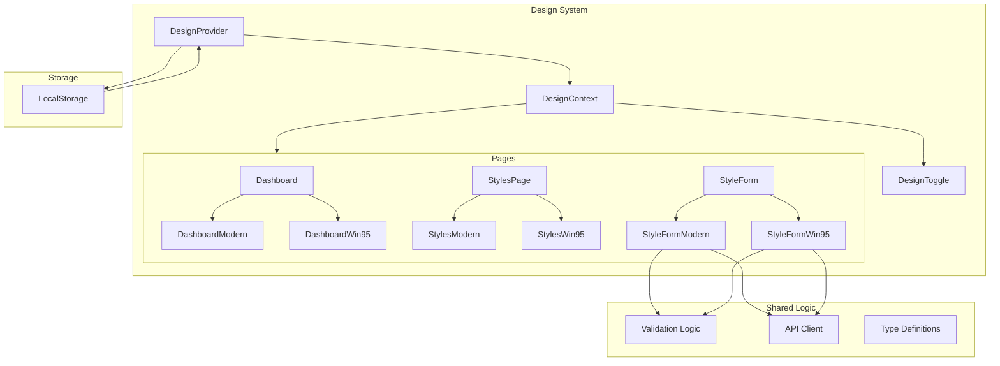

# Design Document: Design Toggle E2E

## Overview

This feature implements a dual-design system that allows users to switch between a modern UI design and a Windows 95 retro design. The implementation uses React Context to manage design state, with components conditionally rendering based on the active design mode. Both design modes share the same business logic and data flows, differing only in visual presentation.

The architecture follows a "wrapper component" pattern where pages use design-aware wrapper components that internally select between modern and Win95 variants based on the current design mode.

## Architecture



## Components and Interfaces

### Design Context

```typescript
// types/design.ts
export type DesignMode = 'win95' | 'modern';

export interface DesignContextType {
  designMode: DesignMode;
  setDesignMode: (mode: DesignMode) => void;
  toggleDesign: () => void;
}
```

### Design Provider (existing, enhanced)

The existing `DesignProvider` component manages design state with localStorage persistence. No changes needed to the core provider logic.

### Design-Aware Page Components

Each page that supports both designs will use a pattern like:

```typescript
// Pattern for design-aware pages
export function PageComponent() {
  const { designMode } = useDesign();

  if (designMode === 'win95') {
    return <PageWin95 />;
  }
  return <PageModern />;
}
```

### Component Structure

```
components/
├── articles/
│   ├── style-form-step1.tsx          # Design-aware wrapper
│   ├── style-form-step1-modern.tsx   # Modern variant
│   ├── style-form-step1-win95.tsx    # Win95 variant
│   ├── style-form-step2.tsx          # Design-aware wrapper
│   ├── style-form-step2-modern.tsx   # Modern variant
│   ├── style-form-step2-win95.tsx    # Win95 variant
│   ├── style-form-step3.tsx          # Design-aware wrapper
│   ├── style-form-step3-modern.tsx   # Modern variant
│   ├── style-form-step3-win95.tsx    # Win95 variant
│   ├── style-card.tsx                # Design-aware wrapper
│   ├── style-card-modern.tsx         # Modern variant
│   ├── style-card-win95.tsx          # Win95 variant
│   └── ...
├── dashboard-content.tsx             # Design-aware dashboard content
├── dashboard-content-modern.tsx      # Modern variant
├── dashboard-content-win95.tsx       # Win95 variant
└── ...
```

## Data Models

### Design Mode State

```typescript
interface DesignState {
  mode: DesignMode;
  mounted: boolean; // Prevents flash of wrong design
}
```

### Style Form Data (shared between both designs)

```typescript
interface StyleFormStep1Data {
  articles: string[];
}

interface StyleFormStep2Data {
  subjects: string[];
}

interface StyleFormStep3Data {
  name: string;
  email: string;
  display_name: string;
  preferred_language: string;
  delivery_days: string[];
}
```

## Correctness Properties

_A property is a characteristic or behavior that should hold true across all valid executions of a system-essentially, a formal statement about what the system should do. Properties serve as the bridge between human-readable specifications and machine-verifiable correctness guarantees._

### Property 1: Design Mode Toggle Alternation

_For any_ design mode state, calling toggleDesign should result in the opposite mode ('win95' → 'modern', 'modern' → 'win95')
**Validates: Requirements 1.1**

### Property 2: Design Mode Persistence Round-Trip

_For any_ design mode, setting the mode and then reading from localStorage should return the same mode value
**Validates: Requirements 1.2, 1.3**

### Property 3: CSS Class Consistency

_For any_ design mode, the document root element should have exactly one design class that matches the current mode ('win95-design' or 'modern-design')
**Validates: Requirements 5.1**

### Property 4: Style Form Data Mode Independence

_For any_ valid form inputs (articles, subjects, settings), the resulting style data structure should be identical regardless of which design mode was active during creation
**Validates: Requirements 2.1, 2.2, 2.3, 2.4**

### Property 5: Navigation Mode Persistence

_For any_ design mode and any sequence of page navigations, the design mode should remain unchanged
**Validates: Requirements 4.3**

### Property 6: Toggle Display Consistency

_For any_ design mode, the toggle button should display an indicator that correctly represents the current mode
**Validates: Requirements 1.4**

## Error Handling

1. **LocalStorage Unavailable**: If localStorage is not available (e.g., private browsing), default to 'win95' mode and continue without persistence
2. **Invalid Stored Value**: If localStorage contains an invalid design mode value, reset to default 'win95' mode
3. **Context Not Available**: Components using `useDesign()` outside of `DesignProvider` will throw a descriptive error
4. **Component Loading**: During initial mount, render children without design-specific styling to prevent flash

## Testing Strategy

### Property-Based Testing

The project will use **fast-check** for property-based testing in TypeScript/JavaScript.

Each property-based test MUST:

- Run a minimum of 100 iterations
- Be tagged with a comment referencing the correctness property: `**Feature: design-toggle-e2e, Property {number}: {property_text}**`
- Test the property across randomly generated inputs

### Unit Tests

Unit tests will cover:

- Design provider initialization with various localStorage states
- Toggle function behavior
- Component variant selection based on design mode
- Form validation logic (shared between both designs)

### Integration Tests

Integration tests will verify:

- Full style creation flow in both design modes produces identical results
- Navigation between pages maintains design mode
- Design toggle persists across page refreshes

### Test File Structure

```
lib/
├── design-toggle.test.ts           # Property tests for design toggle logic
├── design-toggle.unit.test.ts      # Unit tests for design provider
components/
├── articles/
│   └── style-form.test.tsx         # Tests for form data consistency
```
