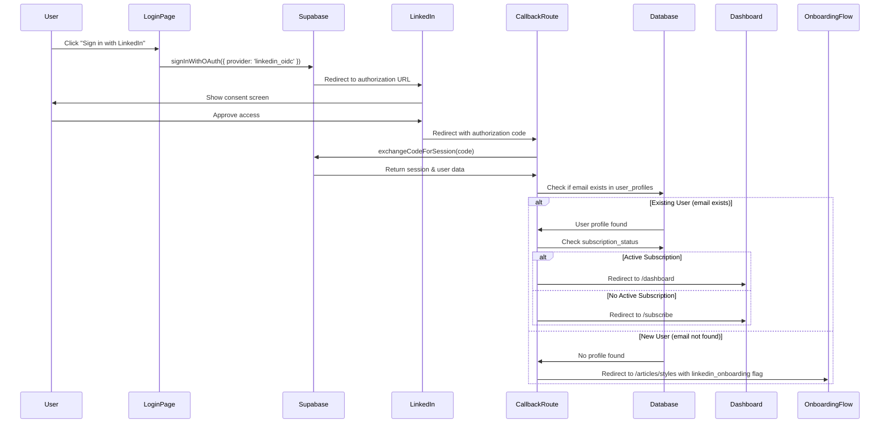
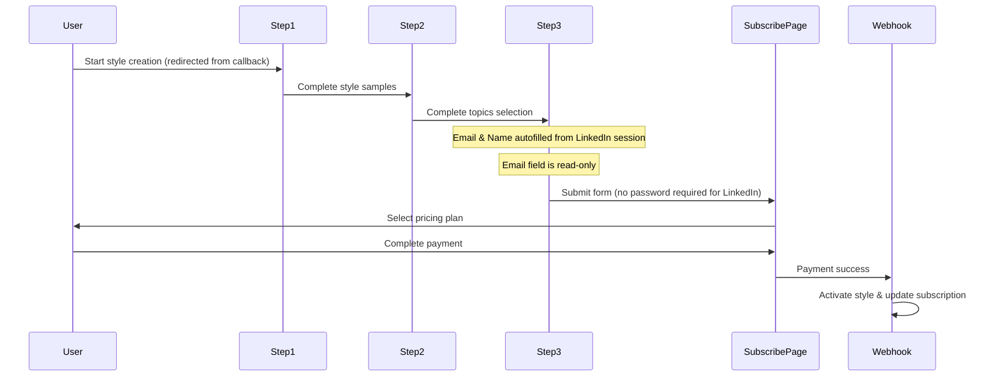

# Design Document: LinkedIn Login

## Overview

This design document outlines the implementation of LinkedIn OAuth login for the Drafter application using Supabase's built-in LinkedIn OIDC provider support. The feature adds a "Sign in with LinkedIn" button to the existing login page, with intelligent routing based on whether the user is new or existing. Existing users are logged in directly, while new users are guided through the onboarding flow with their LinkedIn profile data pre-filled.

## Architecture

The LinkedIn login feature follows the standard OAuth 2.0 authorization code flow with conditional routing:



### New User Onboarding Flow



### Key Architectural Decisions

1. **Use Supabase's LinkedIn OIDC Provider**: Supabase natively supports LinkedIn OIDC, eliminating the need for custom OAuth implementation
2. **Enhanced Callback Handler**: The `/auth/callback` route is extended to check if the LinkedIn email exists in user_profiles and route accordingly
3. **Client-Side OAuth Initiation**: The login button triggers OAuth from the browser using Supabase's client SDK
4. **LinkedIn Session Storage**: For new users, LinkedIn profile data (email, name) is stored in the session/localStorage to persist through the onboarding flow
5. **Password-less Signup for LinkedIn**: New LinkedIn users don't need to set a password since they authenticate via OAuth

## Components and Interfaces

### New Components

#### LinkedInLoginButton

A reusable button component for initiating LinkedIn OAuth login.

```typescript
interface LinkedInLoginButtonProps {
  disabled?: boolean;
  className?: string;
}

function LinkedInLoginButton({ disabled, className }: LinkedInLoginButtonProps): JSX.Element;
```

#### LinkedIn Onboarding Data Storage

Utility functions for storing and retrieving LinkedIn profile data during onboarding.

```typescript
interface LinkedInOnboardingData {
  email: string;
  name: string;
  isLinkedInSignup: boolean;
}

// Store LinkedIn data when new user is detected
function storeLinkedInOnboardingData(data: LinkedInOnboardingData): void;

// Retrieve LinkedIn data in step 3 form
function getLinkedInOnboardingData(): LinkedInOnboardingData | null;

// Clear LinkedIn data after signup completion
function clearLinkedInOnboardingData(): void;
```

### Modified Components

#### Login Page (`app/login/page.tsx`)

- Add LinkedIn login button below the existing email/password form
- Add visual separator ("or continue with") between form and social login options

#### Auth Callback Route (`app/auth/callback/route.ts`)

- Check if LinkedIn email exists in user_profiles table
- For existing users: proceed with current subscription-based redirect logic
- For new users: store LinkedIn data and redirect to `/articles/styles` with `linkedin_onboarding=true` query param

#### Style Form Step 3 (`components/articles/modern/style-form-step3-modern.tsx`)

- Check for LinkedIn onboarding data on mount
- If LinkedIn signup: autofill email and name fields from stored data
- Make email field read-only when autofilled from LinkedIn
- Hide password fields for LinkedIn signups (OAuth handles authentication)
- Update form submission to handle LinkedIn signup flow

#### Signup With Style API (`app/api/auth/signup-with-style/route.ts`)

- Add support for LinkedIn signup (no password required)
- Accept `isLinkedInSignup` flag in request body
- Skip password validation for LinkedIn signups
- Link existing Supabase auth user to new profile (user already authenticated via OAuth)

## Data Models

No new database tables are required. LinkedIn authentication uses the existing:

- `auth.users` table (managed by Supabase Auth)
- `user_profiles` table (for subscription status checks and user data)
- `pending_style_data` table (for storing style data until payment completion)

LinkedIn user data (name, email, profile picture) is automatically stored in the `auth.users` table by Supabase.

### Client-Side Storage (localStorage)

For new LinkedIn users going through onboarding:

```typescript
// Key: 'linkedin_onboarding_data'
interface LinkedInOnboardingData {
  email: string; // LinkedIn email address
  name: string; // LinkedIn display name
  isLinkedInSignup: boolean; // Flag to indicate LinkedIn signup flow
  timestamp: number; // For expiration (24 hours)
}
```

This data is:

- Set by the callback route when a new LinkedIn user is detected
- Read by step 3 form to autofill fields
- Cleared after successful signup completion

## Correctness Properties

_A property is a characteristic or behavior that should hold true across all valid executions of a system-essentially, a formal statement about what the system should do. Properties serve as the bridge between human-readable specifications and machine-verifiable correctness guarantees._

### Property 1: OAuth Provider Parameter

_For any_ invocation of the LinkedIn login function, the Supabase signInWithOAuth method SHALL be called with provider set to 'linkedin_oidc'.
**Validates: Requirements 1.1**

### Property 2: Loading State Disables Interaction

_For any_ LinkedIn login button in loading state, the button SHALL be disabled and display a loading indicator.
**Validates: Requirements 3.4**

### Property 3: Subscription-Based Redirect for Active Users

_For any_ authenticated user with subscription_status equal to 'active', the callback handler SHALL redirect to '/dashboard'.
**Validates: Requirements 4.1, 5.4**

### Property 4: Subscription-Based Redirect for Inactive Users

_For any_ authenticated user with subscription_status not equal to 'active' AND email exists in user_profiles, the callback handler SHALL redirect to '/subscribe'.
**Validates: Requirements 4.2**

### Property 5: Authenticated User Redirect

_For any_ login page render where user is already authenticated, the page SHALL redirect to '/dashboard'.
**Validates: Requirements 4.3**

### Property 6: Existing User Email Matching

_For any_ LinkedIn OAuth callback where the LinkedIn email matches an existing user_profiles email, the system SHALL link the LinkedIn identity to the existing account and preserve all existing user data.
**Validates: Requirements 5.1, 5.3**

### Property 7: New User Redirect to Onboarding

_For any_ LinkedIn OAuth callback where the LinkedIn email does NOT exist in user_profiles, the callback handler SHALL redirect to '/articles/styles' with linkedin_onboarding flag.
**Validates: Requirements 6.1**

### Property 8: LinkedIn Data Autofill

_For any_ step 3 form render where LinkedIn onboarding data exists in storage, the email field SHALL be populated with the LinkedIn email AND the name field SHALL be populated with the LinkedIn display name.
**Validates: Requirements 6.2, 6.3**

### Property 9: Email Field Read-Only for LinkedIn Signup

_For any_ step 3 form where LinkedIn onboarding data exists, the email input field SHALL have the readonly attribute set to true.
**Validates: Requirements 6.6**

### Property 10: LinkedIn Data Persistence During Onboarding

_For any_ new LinkedIn user navigating through the onboarding flow, the LinkedIn session data (email, name) SHALL remain in localStorage until account setup is complete.
**Validates: Requirements 6.7**

### Property 11: Form Submission Redirect for LinkedIn Users

_For any_ successful form submission in step 3 by a LinkedIn user, the system SHALL redirect to the pricing selection page.
**Validates: Requirements 6.4**

## Error Handling

### OAuth Flow Errors

| Error Scenario                          | Handling                                            |
| --------------------------------------- | --------------------------------------------------- |
| User cancels LinkedIn authorization     | Redirect to `/login` with no error (user-initiated) |
| LinkedIn authorization fails            | Redirect to `/login?error=auth_callback_error`      |
| Code exchange fails                     | Redirect to `/login?error=auth_callback_error`      |
| Network error during OAuth              | Display error toast on login page                   |
| Database query fails during email check | Redirect to `/login?error=auth_callback_error`      |
| LinkedIn data storage fails             | Log error, continue with manual entry in step 3     |
| LinkedIn data expired (>24 hours)       | Clear data, redirect to login page                  |

### New User Onboarding Errors

| Error Scenario                  | Handling                                |
| ------------------------------- | --------------------------------------- |
| LinkedIn data missing in step 3 | Allow manual entry of email/name        |
| Form submission fails           | Display error message, allow retry      |
| Profile creation fails          | Display error message with retry option |

### Error Display

- OAuth errors are displayed using the existing error alert component on the login page
- Error messages are user-friendly and don't expose technical details
- Onboarding errors are displayed inline in the form with clear recovery options

## Testing Strategy

### Dual Testing Approach

This feature uses both unit tests and property-based tests for comprehensive coverage.

### Unit Tests

1. **LinkedInLoginButton Component Tests**
   - Renders with correct LinkedIn branding (color, icon)
   - Calls signInWithOAuth with correct provider on click
   - Shows loading state when disabled prop is true
   - Applies custom className when provided

2. **Login Page Integration Tests**
   - LinkedIn button is visible on the login page
   - Separator text "or continue with" is displayed

3. **Auth Callback Route Tests**
   - Existing user with matching email is redirected based on subscription
   - New user (email not found) is redirected to onboarding flow
   - LinkedIn data is stored for new users

4. **Step 3 Form Tests**
   - LinkedIn data is autofilled when present
   - Email field is read-only for LinkedIn signups
   - Password fields are hidden for LinkedIn signups
   - Form submits correctly for LinkedIn users

### Property-Based Tests

Using **fast-check** as the property-based testing library.

1. **Property 1 Test**: OAuth Provider Parameter
   - Generate random click events
   - Verify signInWithOAuth is always called with 'linkedin_oidc'

2. **Property 2 Test**: Loading State Behavior
   - Generate random loading states (true/false)
   - Verify button disabled state matches loading state

3. **Property 3 Test**: Subscription-Based Redirect for Active Users
   - Generate random users with active subscription status
   - Verify redirect to '/dashboard'

4. **Property 4 Test**: Subscription-Based Redirect for Inactive Users
   - Generate random users with non-active subscription status and existing profile
   - Verify redirect to '/subscribe'

5. **Property 5 Test**: Authenticated User Redirect
   - Generate random user objects (null or valid user)
   - Verify redirect behavior when user is present

6. **Property 6 Test**: Existing User Email Matching
   - Generate random LinkedIn emails that match existing profiles
   - Verify identity linking and data preservation

7. **Property 7 Test**: New User Redirect to Onboarding
   - Generate random LinkedIn emails that don't exist in profiles
   - Verify redirect to '/articles/styles' with linkedin_onboarding flag

8. **Property 8 Test**: LinkedIn Data Autofill
   - Generate random LinkedIn onboarding data objects
   - Verify email and name fields are populated correctly

9. **Property 9 Test**: Email Field Read-Only
   - Generate random LinkedIn onboarding data presence (true/false)
   - Verify email field readonly attribute matches data presence

10. **Property 10 Test**: LinkedIn Data Persistence
    - Generate random navigation sequences through onboarding
    - Verify LinkedIn data remains in localStorage until completion

11. **Property 11 Test**: Form Submission Redirect
    - Generate random valid form submissions for LinkedIn users
    - Verify redirect to pricing selection page

### Test Configuration

- Property-based tests configured for minimum 100 iterations
- Each property test tagged with format: `**Feature: linkedin-login, Property {number}: {property_text}**`

## Setup Documentation

A `SETUP.md` file will be created in the linkedin folder with:

1. **LinkedIn Developer Portal Setup**
   - Creating a LinkedIn application
   - Configuring OAuth 2.0 settings
   - Adding authorized redirect URIs

2. **Supabase Configuration**
   - Enabling LinkedIn OIDC provider
   - Adding Client ID and Client Secret
   - Verifying redirect URI configuration

3. **Environment Variables**
   - No additional environment variables needed (credentials stored in Supabase)

4. **Troubleshooting Guide**
   - Common OAuth errors and solutions
   - Redirect URI mismatch issues
   - Scope and permission problems
