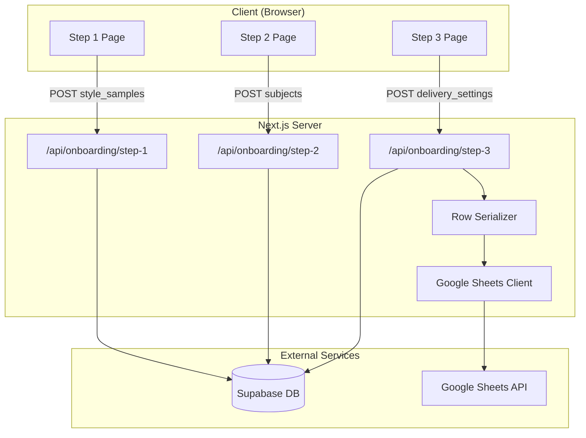

# Design Document

## Overview

This design describes a 3-step onboarding wizard that collects user preferences and appends the consolidated data to Google Sheets. The system uses Next.js App Router with React client components for the UI, server-side API routes for data persistence, and the Google Sheets API for external data storage.

The onboarding flow consists of:

1. **Step 1**: Style sample collection (3 text areas for writing samples)
2. **Step 2**: Subject/topic selection with AI suggestions
3. **Step 3**: Delivery settings (email, name, language, schedule)

Upon completion, all data is serialized into a row format and appended to a Google Sheets spreadsheet.

## Architecture



## Components and Interfaces

### Client Components

#### Step1Page

- Renders 3 text areas for style samples
- Tracks word count per sample
- Validates at least one non-empty sample before enabling continue
- Calls `/api/onboarding/step-1` on submit

#### Step2Page

- Renders subject input with add button
- Displays list of added subjects with remove capability
- AI helper panel with suggestion list
- Validates at least one subject before enabling continue
- Calls `/api/onboarding/step-2` on submit

#### Step3Page

- Renders email, first name, last name inputs
- Day selection checkboxes with "every day" toggle
- Language dropdown selector
- Validates all required fields before enabling complete
- Calls `/api/onboarding/step-3` on submit

### Server Components

#### API Route: `/api/onboarding/step-1`

```typescript
interface Step1Request {
  user_id: string
  style_samples: string[]
}

interface Step1Response {
  success: boolean
  error?: string
}
```

#### API Route: `/api/onboarding/step-2`

```typescript
interface Step2Request {
  user_id: string
  subjects: string[]
}

interface Step2Response {
  success: boolean
  error?: string
}
```

#### API Route: `/api/onboarding/step-3`

```typescript
interface Step3Request {
  user_id: string
  email: string
  display_name: string
  preferred_language: string
  delivery_days: string[]
}

interface Step3Response {
  success: boolean
  redirectTo?: string
  error?: string
}
```

### Google Sheets Integration

#### GoogleSheetsClient

```typescript
interface GoogleSheetsClient {
  appendRow(spreadsheetId: string, sheetName: string, values: string[]): Promise<void>
}
```

#### RowSerializer

```typescript
interface OnboardingRowData {
  email: string
  display_name: string
  created_at: string
  preferred_language: string
  delivery_days: string[]
  status: 'active' | 'paused'
  style_samples: string[]
  subjects: string[]
}

function serializeToRow(data: OnboardingRowData): string[]
function deserializeFromRow(row: string[]): OnboardingRowData
```

## Data Models

### Supabase: onboarding_data table

| Column             | Type        | Description                                      |
| ------------------ | ----------- | ------------------------------------------------ |
| user_id            | uuid        | Primary key, references auth.users               |
| style_samples      | text[]      | Array of style sample texts                      |
| subjects           | text[]      | Array of selected subjects                       |
| email              | text        | User's email address                             |
| display_name       | text        | User's full name                                 |
| preferred_language | text        | Language code (e.g., 'en', 'es')                 |
| delivery_days      | text[]      | Array of day codes (e.g., ['mon', 'wed', 'fri']) |
| completed_at       | timestamptz | When onboarding was completed                    |
| updated_at         | timestamptz | Last update timestamp                            |

### Google Sheets Row Format

| Column | Index | Content                                   |
| ------ | ----- | ----------------------------------------- |
| A      | 0     | Email                                     |
| B      | 1     | Display Name                              |
| C      | 2     | Created At (ISO timestamp)                |
| D      | 3     | Preferred Language                        |
| E      | 4     | Delivery Days (comma-separated)           |
| F      | 5     | Status                                    |
| G      | 6     | Style Samples (comma-separated summaries) |
| H      | 7     | Subjects (comma-separated)                |

## Correctness Properties

_A property is a characteristic or behavior that should hold true across all valid executions of a system-essentially, a formal statement about what the system should do. Properties serve as the bridge between human-readable specifications and machine-verifiable correctness guarantees._

### Property 1: Word count accuracy

_For any_ input string, the displayed word count SHALL equal the number of whitespace-separated non-empty tokens in that string.

**Validates: Requirements 1.2**

### Property 2: Style sample validation enables continue

_For any_ array of three style sample strings, the continue button SHALL be enabled if and only if at least one string has non-zero length after trimming whitespace.

**Validates: Requirements 1.3, 1.5**

### Property 3: Subject addition preserves uniqueness

_For any_ existing subject list and any new subject string, adding the subject SHALL result in a list that contains the new subject exactly once (if non-empty and not already present) or remains unchanged (if empty, whitespace-only, or duplicate).

**Validates: Requirements 2.2, 2.6**

### Property 4: AI suggestion selection moves item between lists

_For any_ subject list and suggestions list, selecting a suggestion SHALL result in the suggestion appearing in the subject list and being removed from the suggestions list, with no other changes to either list.

**Validates: Requirements 2.4**

### Property 5: Subject list validation enables continue

_For any_ subject list, the continue button SHALL be enabled if and only if the list contains at least one element.

**Validates: Requirements 2.5**

### Property 6: Day selection toggle is idempotent

_For any_ set of selected days and any day to toggle, toggling the same day twice SHALL return the selection to its original state.

**Validates: Requirements 3.2**

### Property 7: Form validation enables complete

_For any_ form state with email, firstName, lastName, and deliveryDays fields, the complete button SHALL be enabled if and only if email is non-empty, firstName is non-empty, lastName is non-empty, and deliveryDays contains at least one element.

**Validates: Requirements 3.4, 3.5**

### Property 8: Serialized row contains all required fields

_For any_ valid OnboardingRowData object, the serialized row array SHALL have exactly 8 elements containing: email at index 0, display_name at index 1, created_at at index 2, preferred_language at index 3, delivery_days at index 4, status at index 5, style_samples at index 6, and subjects at index 7.

**Validates: Requirements 4.3, 5.1**

### Property 9: Serialization round-trip preserves data

_For any_ valid OnboardingRowData object, deserializing the serialized representation SHALL produce an object equivalent to the original input.

**Validates: Requirements 5.4**

## Error Handling

### Client-Side Errors

- **Network failures**: Display error message with retry option, maintain form state
- **Validation errors**: Prevent form submission, highlight invalid fields
- **Session expiration**: Redirect to login page

### Server-Side Errors

- **Database errors**: Return 500 status with error message, log details
- **Google Sheets API errors**: Log error, return failure response (do not block onboarding completion in Supabase)
- **Invalid request data**: Return 400 status with validation error details

### Error Response Format

```typescript
interface ErrorResponse {
  error: string
  details?: Record<string, string>
}
```

## Testing Strategy

### Property-Based Testing Library

The project will use **fast-check** for property-based testing in TypeScript/JavaScript. Each property test will run a minimum of 100 iterations.

### Unit Tests

Unit tests will cover:

- Individual component rendering
- Form field interactions
- API route request/response handling
- Error state handling

### Property-Based Tests

Property-based tests will verify the correctness properties defined above:

1. **Word count property**: Generate random strings, verify word count matches `string.trim().split(/\s+/).filter(Boolean).length`
2. **Style sample validation property**: Generate arrays of 3 strings (including empty, whitespace-only, and non-empty), verify button state
3. **Subject addition property**: Generate existing lists and new subjects, verify list behavior
4. **AI suggestion selection property**: Generate subject and suggestion lists, verify item movement
5. **Subject list validation property**: Generate lists of various lengths, verify button state
6. **Day toggle idempotence property**: Generate day selections and toggle targets, verify double-toggle returns to original
7. **Form validation property**: Generate form states with various field combinations, verify button state
8. **Row field completeness property**: Generate valid OnboardingRowData, verify serialized array structure
9. **Round-trip property**: Generate valid OnboardingRowData, serialize then deserialize, compare to original

### Test Annotations

Each property-based test must include a comment in this format:

```typescript
// **Feature: onboarding-google-sheets, Property {number}: {property_text}**
```

### Integration Tests

Integration tests will verify:

- End-to-end onboarding flow
- Supabase data persistence
- Google Sheets API integration (with mocked responses)
