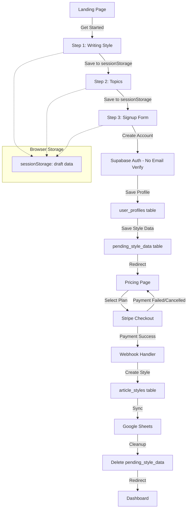
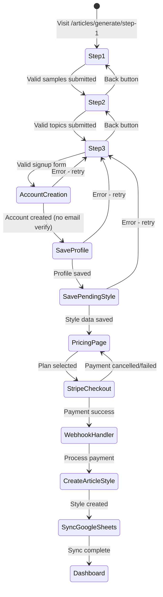

# Design Document: Onboarding Signup Flow (Updated)

## Overview

This design describes a unified 3-step onboarding wizard that allows anonymous visitors to define their writing style, select topics, and complete account creation. After signup, users are redirected to the pricing page to select a plan and complete Stripe payment. Upon successful payment, style data is persisted to the database and synchronized to Google Sheets.

Key architectural changes from the previous implementation:

- Email verification is skipped (email_confirm: true)
- User record is saved immediately after step 3 completion
- Style data is stored in pending_style_data table until payment completes
- After payment success, data flows to article_styles table AND Google Sheets
- Robust error handling with retry capability at each step

## Architecture



### Flow States



## Components and Interfaces

### Frontend Components

#### 1. OnboardingLayout (`app/articles/generate/layout.tsx`)

- No authentication required
- Public header with logo only
- Progress indicator showing current step

#### 2. Step1Page (`app/articles/generate/step-1/page.tsx`)

- Load/save draft from sessionStorage
- Validate minimum 1 sample with 100+ characters each
- Display validation errors inline

#### 3. Step2Page (`app/articles/generate/step-2/page.tsx`)

- Load/save draft from sessionStorage
- Validate minimum 1 topic with 3-200 characters
- Display validation errors inline

#### 4. Step3Page (`app/articles/generate/step-3/page.tsx`)

- Signup form: name, email, password, confirmPassword, job
- Load draft data from sessionStorage
- Call `/api/auth/signup-with-style` endpoint
- Handle errors with retry capability
- Redirect to `/pricing` on success
- Clear sessionStorage on successful redirect

### API Routes

#### 1. POST `/api/auth/signup-with-style` (Updated)

Creates user account without email verification and stores pending style data.

```typescript
interface SignupWithStyleRequest {
  name: string;
  email: string;
  password: string;
  confirmPassword: string;
  job: string;
  style_samples: string[];
  subjects: string[];
  preferred_language: string;
  delivery_days: string[];
}

interface SignupWithStyleResponse {
  success: true;
  user_id: string;
  redirect_url: string; // '/pricing'
}

interface SignupWithStyleErrorResponse {
  success: false;
  error: string;
  fields?: Record<string, string>; // Field-specific errors
  retry: boolean; // Whether the operation can be retried
}
```

**Implementation changes:**

- Set `email_confirm: true` when creating user to skip verification
- Save user profile immediately after account creation
- Store style data in `pending_style_data` table
- Return redirect URL to pricing page

#### 2. POST `/api/stripe/checkout` (Modified)

Add pending_style flag to checkout metadata.

```typescript
interface CheckoutRequest {
  plan_id: string;
}

// Metadata added to Stripe session:
{
  user_id: string;
  plan_id: string;
  pending_style: 'true' | 'false';
}
```

#### 3. Webhook Handler `/api/stripe/webhook` (Modified)

On `checkout.session.completed`:

1. Check for `pending_style: 'true'` in metadata
2. Fetch pending style data from `pending_style_data` table
3. Create `article_styles` record
4. Sync to Google Sheets with job field
5. Delete `pending_style_data` record
6. Update user profile subscription status

### Services

#### 1. DraftSessionService (Client-side)

```typescript
interface DraftSession {
  style_samples: string[];
  subjects: string[];
  preferred_language: string;
  delivery_days: string[];
  current_step: number;
  last_updated: string;
}

class DraftSessionService {
  static save(data: Partial<DraftSession>): void;
  static load(): DraftSession | null;
  static clear(): void;
  static getStep(): number;
}
```

#### 2. ArticleStylesSyncService

Syncs article style data to Google Sheets including job field.

```typescript
interface SyncResult {
  success: boolean;
  error?: string;
  sheetRowId?: string;
}

async function syncStyleToSheets(articleStyle: ArticleStyle, job: string): Promise<SyncResult>;
```

## Data Models

### pending_style_data Table (New/Updated)

```sql
CREATE TABLE IF NOT EXISTS pending_style_data (
  id UUID PRIMARY KEY DEFAULT gen_random_uuid(),
  user_id UUID NOT NULL REFERENCES user_profiles(id) ON DELETE CASCADE,
  display_name VARCHAR(255),
  style_samples JSONB NOT NULL DEFAULT '[]',
  subjects JSONB NOT NULL DEFAULT '[]',
  preferred_language VARCHAR(10) DEFAULT 'en',
  delivery_days JSONB DEFAULT '[]',
  job VARCHAR(255),
  created_at TIMESTAMP WITH TIME ZONE DEFAULT NOW(),
  updated_at TIMESTAMP WITH TIME ZONE DEFAULT NOW(),
  UNIQUE(user_id)
);
```

### user_profiles Table (Existing)

```sql
-- Relevant fields
id UUID PRIMARY KEY,
email VARCHAR(255),
display_name VARCHAR(255),
job VARCHAR(255),
subscription_status VARCHAR(50) DEFAULT 'incomplete',
subscription_plan VARCHAR(50) DEFAULT 'free',
stripe_customer_id VARCHAR(255),
onboarding_completed BOOLEAN DEFAULT FALSE
```

### article_styles Table (Existing)

```sql
-- Relevant fields
id UUID PRIMARY KEY,
user_id UUID REFERENCES user_profiles(id),
name VARCHAR(255),
email VARCHAR(255),
display_name VARCHAR(255),
style_samples JSONB,
subjects JSONB,
preferred_language VARCHAR(10),
delivery_days JSONB,
is_active BOOLEAN DEFAULT TRUE,
status VARCHAR(50) DEFAULT 'active'
```

### DraftSession (sessionStorage)

```typescript
interface DraftSession {
  style_samples: string[];
  subjects: string[];
  preferred_language: string;
  delivery_days: string[];
  current_step: 1 | 2 | 3;
  last_updated: string; // ISO timestamp
}
```

## Correctness Properties

_A property is a characteristic or behavior that should hold true across all valid executions of a system-essentially, a formal statement about what the system should do. Properties serve as the bridge between human-readable specifications and machine-verifiable correctness guarantees._

### Property 1: Style Sample Validation

_For any_ string input to a style sample field, the validation function SHALL return true if and only if the string length is greater than or equal to 100 characters.
**Validates: Requirements 2.2**

### Property 2: Topic Validation

_For any_ string input to a topic field, the validation function SHALL return true if and only if the string length is between 3 and 200 characters inclusive.
**Validates: Requirements 3.2**

### Property 3: Signup Form Validation

_For any_ signup form data object, the validation function SHALL return errors for: name with fewer than 2 characters, email not matching valid email pattern, password with fewer than 8 characters, confirmPassword not matching password, job with fewer than 2 characters.
**Validates: Requirements 4.2**

### Property 4: Draft Session Round-Trip

_For any_ valid draft session data, saving to sessionStorage and then loading should return an equivalent object. This property covers both navigation between steps and page refresh scenarios.
**Validates: Requirements 5.1, 5.2**

## Error Handling

### Client-Side Errors

| Error Type                  | Handling                                                   | Retry                       |
| --------------------------- | ---------------------------------------------------------- | --------------------------- |
| Validation errors           | Display inline field errors below each invalid field       | User corrects and resubmits |
| Session storage unavailable | Fall back to component state, warn user data won't persist | N/A                         |
| Network errors              | Display toast with retry button                            | Yes                         |
| Account creation failed     | Display specific error message, allow retry                | Yes                         |
| Style data save failed      | Display error message, allow retry                         | Yes                         |

### Server-Side Errors

| Error Type                | HTTP Status | Response                                                                                 | User Action                  |
| ------------------------- | ----------- | ---------------------------------------------------------------------------------------- | ---------------------------- |
| Invalid signup data       | 400         | `{ success: false, error: "Validation failed", fields: {...}, retry: true }`             | Fix fields and retry         |
| Email already exists      | 409         | `{ success: false, error: "An account with this email already exists", retry: false }`   | Use different email or login |
| Database error (profile)  | 500         | `{ success: false, error: "Failed to save profile. Please try again.", retry: true }`    | Retry                        |
| Database error (style)    | 500         | `{ success: false, error: "Failed to save style data. Please try again.", retry: true }` | Retry                        |
| Stripe checkout failed    | 500         | `{ success: false, error: "Payment setup failed. Please try again.", retry: true }`      | Retry                        |
| Google Sheets sync failed | 200         | Log error, don't block user                                                              | None (background retry)      |

### Recovery Flows

1. **Account creation error**: User stays on step 3, can retry with same or different data
2. **Style data save error**: User stays on step 3, can retry (account already created)
3. **Payment cancelled**: User returns to pricing page, can select plan again
4. **Payment failed**: User can retry from Stripe-hosted page or return to pricing
5. **Webhook processing error**: Payment recorded, admin notified for manual recovery
6. **Google Sheets sync failed**: Background job retries, doesn't block user

### Error Message Guidelines

- Be specific about what went wrong
- Provide clear action the user can take
- Don't expose technical details to users
- Log full error details server-side for debugging

## Testing Strategy

### Unit Tests

- Validation functions for each field type
- DraftSessionService save/load/clear operations
- Form state management
- Error message formatting

### Property-Based Tests

Using `fast-check` library for TypeScript:

1. **Style Sample Validation Property** (Property 1)
   - Generate random strings of varying lengths
   - Verify validation returns correct boolean based on 100-char threshold

2. **Topic Validation Property** (Property 2)
   - Generate random strings of varying lengths
   - Verify validation returns correct boolean for 3-200 char range

3. **Signup Form Validation Property** (Property 3)
   - Generate random form data objects
   - Verify validation returns appropriate errors for each field rule

4. **Draft Session Round-Trip Property** (Property 4)
   - Generate random valid draft session objects
   - Verify save then load returns equivalent data

### Integration Tests

- Full flow from step 1 to pricing page redirect
- Session persistence across navigation
- Error recovery scenarios
- Stripe webhook processing with pending style data

### Test Configuration

- Property tests: minimum 100 iterations per property
- Use `fast-check` for property-based testing
- Each property test tagged with: `**Feature: onboarding-signup-flow, Property {N}: {description}**`
