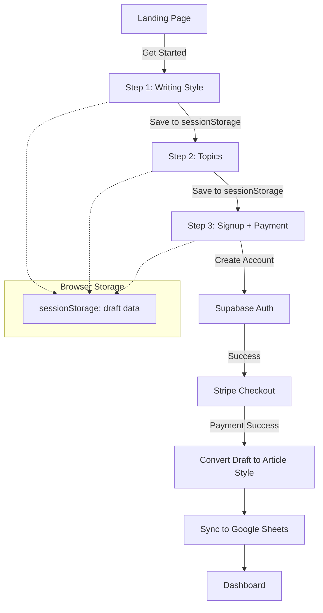
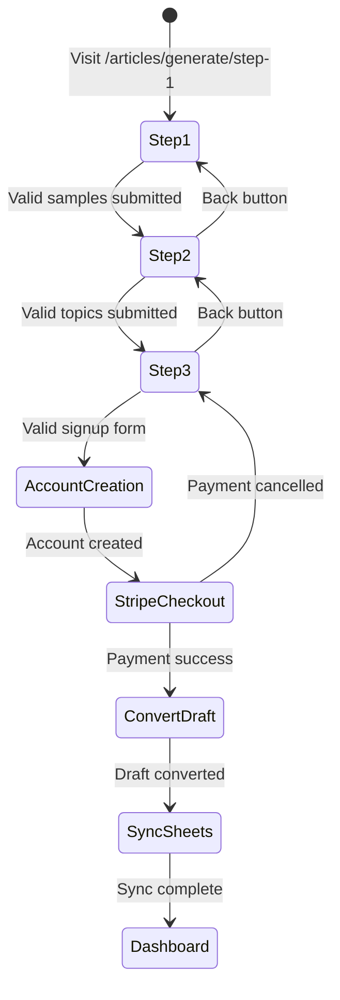

# Design Document: Onboarding Signup Flow

## Overview

This design describes a unified 3-step onboarding wizard that allows anonymous visitors to define their writing style, select topics, and complete account creation with payment in a single streamlined flow. The flow replaces the current separate signup and article style creation processes.

The key architectural change is removing the authentication requirement from the article generation wizard and adding signup/payment functionality to step 3. Draft data is stored in browser sessionStorage until account creation, then converted to permanent database records.

## Architecture



### Flow States



## Components and Interfaces

### Frontend Components

#### 1. OnboardingLayout (`app/articles/generate/layout.tsx`)

- Remove `ProtectedRoute` wrapper
- Add public header with logo only (no auth buttons)
- Maintain progress indicator

#### 2. Step1Page (`app/articles/generate/step-1/page.tsx`)

- Remove user authentication check
- Load/save draft from sessionStorage
- Validate minimum 1 sample with 100+ characters each

#### 3. Step2Page (`app/articles/generate/step-2/page.tsx`)

- Remove user authentication check
- Load/save draft from sessionStorage
- Validate minimum 1 topic with 3-200 characters

#### 4. Step3Page (`app/articles/generate/step-3/page.tsx`)

- Complete redesign to include signup form
- Fields: name, email, password, confirmPassword, job
- Integrate with Supabase Auth for account creation
- Redirect to Stripe checkout after signup
- Handle payment success callback

### API Routes

#### 1. POST `/api/auth/signup-with-style`

New endpoint that combines signup with article style creation.

```typescript
interface SignupWithStyleRequest {
  name: string;
  email: string;
  password: string;
  job: string;
  style_samples: string[];
  subjects: string[];
  preferred_language: string;
  delivery_days: string[];
}

interface SignupWithStyleResponse {
  user_id: string;
  checkout_url: string;
}
```

#### 2. POST `/api/stripe/checkout` (Modified)

Add support for pending article style data.

```typescript
interface CheckoutRequest {
  plan_id: string;
  pending_style_data?: {
    style_samples: string[];
    subjects: string[];
    preferred_language: string;
    delivery_days: string[];
    job: string;
  };
}
```

#### 3. Webhook Handler `/api/stripe/webhook` (Modified)

On successful payment:

1. Create article_style record from pending data
2. Sync to Google Sheets with job field
3. Update user profile with job field

### Services

#### 1. DraftSessionService (Client-side)

```typescript
interface DraftSession {
  style_samples: string[];
  subjects: string[];
  preferred_language: string;
  delivery_days: string[];
  current_step: number;
  last_updated: string;
}

class DraftSessionService {
  static save(data: Partial<DraftSession>): void;
  static load(): DraftSession | null;
  static clear(): void;
  static getStep(): number;
}
```

#### 2. ArticleStylesSyncService (Modified)

Add job field to Google Sheets sync.

## Data Models

### Updated MainSheetRowData

```typescript
interface MainSheetRowData {
  sheetName: string;
  customerName: string;
  customerEmail: string;
  customerJob: string; // NEW FIELD
  language: string;
  emailMonday: boolean;
  emailTuesday: boolean;
  emailWednesday: boolean;
  emailThursday: boolean;
  emailFriday: boolean;
  emailSaturday: boolean;
  emailSunday: boolean;
  paywallStatus: string;
  endOfMembership: string;
  customerSheetCreated: string;
  article1Example: string;
  article2Example: string;
  article3Example: string;
}
```

### Updated UserProfile (Database)

```sql
ALTER TABLE user_profiles ADD COLUMN job VARCHAR(255);
```

### DraftSession (sessionStorage)

```typescript
interface DraftSession {
  style_samples: string[];
  subjects: string[];
  preferred_language: string;
  delivery_days: string[];
  current_step: 1 | 2 | 3;
  last_updated: string; // ISO timestamp
}
```

### PendingStyleData (Stripe Metadata)

```typescript
interface PendingStyleData {
  style_samples: string; // JSON stringified array
  subjects: string; // JSON stringified array
  preferred_language: string;
  delivery_days: string; // JSON stringified array
  job: string;
}
```

## Correctness Properties

_A property is a characteristic or behavior that should hold true across all valid executions of a system-essentially, a formal statement about what the system should do. Properties serve as the bridge between human-readable specifications and machine-verifiable correctness guarantees._

### Property 1: Style Sample Validation

_For any_ string input to a style sample field, the validation function SHALL return true if and only if the string length is greater than or equal to 100 characters.
**Validates: Requirements 2.2**

### Property 2: Topic Validation

_For any_ string input to a topic field, the validation function SHALL return true if and only if the string length is between 3 and 200 characters inclusive.
**Validates: Requirements 3.2**

### Property 3: Signup Form Validation

_For any_ signup form data object, the validation function SHALL return errors for: name with fewer than 2 characters, email not matching valid email pattern, password with fewer than 8 characters, confirmPassword not matching password, job with fewer than 2 characters.
**Validates: Requirements 4.2**

### Property 4: Draft Session Round-Trip (Navigation)

_For any_ valid draft session data, saving to sessionStorage and then loading should return an equivalent object.
**Validates: Requirements 5.1**

### Property 5: Draft Session Round-Trip (Refresh)

_For any_ valid draft session data stored in sessionStorage, refreshing the page and loading the session should return an equivalent object.
**Validates: Requirements 5.2**

## Error Handling

### Client-Side Errors

| Error Type                  | Handling                                                   |
| --------------------------- | ---------------------------------------------------------- |
| Validation errors           | Display inline field errors below each invalid field       |
| Session storage unavailable | Fall back to component state, warn user data won't persist |
| Network errors              | Display toast with retry option                            |

### Server-Side Errors

| Error Type                | HTTP Status | Response                                        |
| ------------------------- | ----------- | ----------------------------------------------- |
| Invalid signup data       | 400         | `{ error: "Validation failed", fields: {...} }` |
| Email already exists      | 409         | `{ error: "Email already registered" }`         |
| Stripe checkout failed    | 500         | `{ error: "Payment setup failed" }`             |
| Google Sheets sync failed | 200         | Log error, don't block user (non-critical)      |

### Recovery Flows

1. **Payment cancelled**: User returns to step 3, account exists but inactive
2. **Payment failed**: User can retry from Stripe-hosted page
3. **Sync failed**: Background job retries, admin notified

## Testing Strategy

### Unit Tests

- Validation functions for each field type
- DraftSessionService save/load/clear operations
- Form state management

### Property-Based Tests

Using `fast-check` library for TypeScript:

1. **Style Sample Validation Property** (Property 1)
   - Generate random strings of varying lengths
   - Verify validation returns correct boolean based on 100-char threshold

2. **Topic Validation Property** (Property 2)
   - Generate random strings of varying lengths
   - Verify validation returns correct boolean for 3-200 char range

3. **Signup Form Validation Property** (Property 3)
   - Generate random form data objects
   - Verify validation returns appropriate errors for each field rule

4. **Draft Session Round-Trip Property** (Properties 4 & 5)
   - Generate random valid draft session objects
   - Verify save then load returns equivalent data

### Integration Tests

- Full flow from step 1 to payment success
- Session persistence across navigation
- Error recovery scenarios

### Test Configuration

- Property tests: minimum 100 iterations per property
- Use `fast-check` for property-based testing
- Each property test tagged with: `**Feature: onboarding-signup-flow, Property {N}: {description}**`
