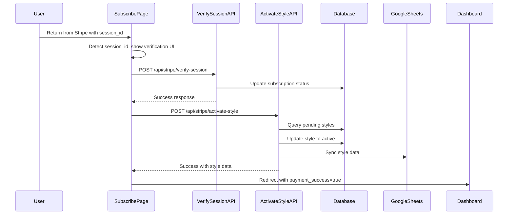

# Design Document: Payment Success Flow

## Overview

This design addresses the bug where users returning from Stripe checkout see the pricing selection screen instead of a proper payment verification flow. The solution adds a verification state to the subscribe page that:

1. Detects the `session_id` URL parameter from Stripe
2. Displays an animated progress screen showing setup steps
3. Verifies the payment via the existing `/api/stripe/verify-session` endpoint
4. Activates any pending article style created during signup
5. Syncs the activated style to Google Sheets
6. Auto-redirects to the dashboard upon completion

## Architecture



## Components and Interfaces

### 1. Subscribe Page Enhancement

The existing `app/subscribe/page.tsx` will be enhanced to:

- Check for `session_id` URL parameter on mount
- Render a `PaymentVerification` component when session_id is present
- Handle the multi-step verification flow

```typescript
interface VerificationStep {
  id: string;
  label: string;
  status: 'pending' | 'in-progress' | 'complete' | 'error';
}

interface PaymentVerificationProps {
  sessionId: string;
  onComplete: () => void;
  onError: (error: string) => void;
}
```

### 2. New API Endpoint: Activate Style

A new endpoint `POST /api/stripe/activate-style` will handle:

- Finding pending article styles for the user
- Activating the style (setting `is_active: true`, `status: 'active'`)
- Syncing to Google Sheets
- Returning the activated style data

```typescript
// Request
interface ActivateStyleRequest {
  // No body needed - uses authenticated user from session
}

// Response
interface ActivateStyleResponse {
  success: boolean;
  style?: ArticleStyle;
  sheetsSync?: {
    success: boolean;
    error?: string;
  };
  message?: string;
}
```

### 3. PaymentVerification Component

A new component that displays the verification progress:

```typescript
const VERIFICATION_STEPS: VerificationStep[] = [
  { id: 'verify', label: 'Verifying Payment', status: 'pending' },
  { id: 'activate', label: 'Activating Your Style', status: 'pending' },
  { id: 'sync', label: 'Syncing Your Data', status: 'pending' },
  { id: 'complete', label: 'Setup Complete', status: 'pending' },
];
```

## Data Models

### Article Style Status Update

The existing `article_styles` table will be updated:

```sql
-- Pending style (created during signup)
status: 'pending'
is_active: false

-- After activation
status: 'active'
is_active: true
```

### Verification State

```typescript
interface VerificationState {
  steps: VerificationStep[];
  currentStep: number;
  error: string | null;
  isComplete: boolean;
}
```

## Correctness Properties

_A property is a characteristic or behavior that should hold true across all valid executions of a system-essentially, a formal statement about what the system should do. Properties serve as the bridge between human-readable specifications and machine-verifiable correctness guarantees._

Based on the prework analysis, the following properties have been identified:

### Property 1: Session ID Detection

_For any_ URL with a session_id parameter, the subscribe page should render the verification screen instead of the pricing selection screen.
**Validates: Requirements 1.1**

### Property 2: Pending Style Activation

_For any_ user with a pending article style (is_active=false, status='pending'), after calling the activate-style endpoint, the style should have is_active=true and status='active'.
**Validates: Requirements 2.2**

### Property 3: Missing Style Handling

_For any_ user without a pending article style, the activate-style endpoint should return success without error and the flow should continue.
**Validates: Requirements 2.4**

### Property 4: Sheets Sync Data Completeness

_For any_ activated article style, the data passed to Google Sheets sync should contain all required fields: customerName, customerEmail, language, delivery days, and style samples.
**Validates: Requirements 3.2, 3.3**

### Property 5: Sync Error Resilience

_For any_ Google Sheets sync error, the activate-style endpoint should return success for the style activation and include the sync error in the response without throwing.
**Validates: Requirements 3.5**

### Property 6: Redirect URL Construction

_For any_ successful verification completion, the redirect URL should be `/dashboard?payment_success=true`.
**Validates: Requirements 5.3**

## Error Handling

### Payment Verification Errors

- **Invalid session_id**: Display error message, offer to return to pricing
- **Session not paid**: Display "Payment pending" message with retry option
- **Network error**: Display retry button, allow manual retry

### Style Activation Errors

- **Database error**: Log error, display generic message, allow retry
- **No pending style**: Skip activation step silently, continue flow

### Google Sheets Sync Errors

- **Missing credentials**: Log warning, continue without blocking
- **API error**: Log error, continue without blocking
- **Network timeout**: Log error, continue without blocking

## Testing Strategy

### Unit Tests

- Test `PaymentVerification` component renders correct steps
- Test step status transitions (pending → in-progress → complete)
- Test error state rendering
- Test redirect URL construction

### Property-Based Tests

Using Vitest with fast-check for property-based testing:

1. **Session ID Detection Property**: Generate random URLs with/without session_id, verify correct component rendering
2. **Style Activation Property**: Generate random pending styles, verify activation updates correct fields
3. **Sync Error Resilience Property**: Generate random sync errors, verify endpoint returns success
4. **Redirect URL Property**: Verify redirect URL always contains payment_success parameter

### Integration Tests

- Test full verification flow with mocked Stripe API
- Test style activation with test database
- Test Google Sheets sync with mocked sheets API
